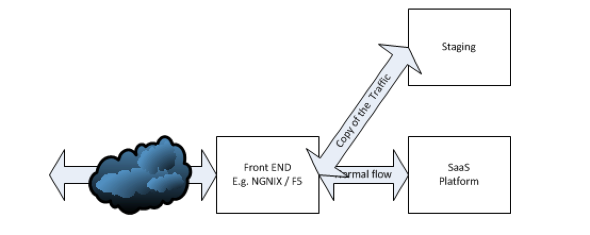

# Summary:

Fork-Traffic is a home-grown testing tool that enables real-time testing of a service’s newer version. Without interfering with the operation of the existing service, Fork-Traffic copies HTTP traffic and send that to the newer version. Users of this tool will need to add a mechanism to capture/measured/analyzed the test data for performance evaluation. Given the lack of readily available tools in the market that boast the same capability, we believe that this tool would be a valuable addition to the open source community.

Fork-Traffic , inspired by our needs to redesign with a high level of confidence, before we switched to the new implementation.

The tool should be supplemented with a method to measure the observation

## About:

This tools is part of production testing approach, We used it to verify new service or platform implementation side by side with previous implementation

In a SaaS world the tool copy HTTP traffic from destination A to destination B, and only response to request from original service A

  
  

B received the traffic and perform the transaction and we compare the observation between the two implementations

## Features:

Route source to original destination
Copy HTTP traffic to an alternative destination (service under test),  maintain TCP connection but NOT reply back with responses from system under test.
In case of a need to modify headers due to authorization/authentication e.g. the source can modify the state.

## Technical Specs:
Backend components implemented in Go

## Quick Start:
Todo: We need to learn how we release a container.

## Contributor

Dan Bar-lev Dan.BarLev@adp.com
Eitan Klein -  eitan.klein@adp.com
